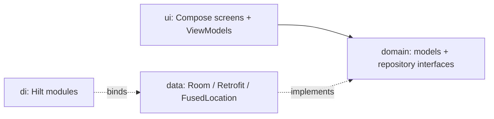

# Coursework

An Android run-tracking app. Start a run, watch your route draw itself on the map in real time, and get a summary with distance, pace, and the weather you ran in. Past runs are grouped by run type, so a "5K Park Loop" is tracked against previous 5K Park Loops rather than against everything you have ever run.

Built with Jetpack Compose, Room, Hilt, and the Google Maps and OpenWeather APIs.

## Features

- **Live run tracking** — GPS route drawn on a Maps Compose map as you move, with running distance and duration.
- **User-defined run types** — create categories with a target distance (for example "5K Park Loop"), and runs that reach the target get a "Done!" badge.
- **Dashboard metrics** — average pace, best time, weekly distance, and a week-on-week trend percentage.
- **Run history** — every session with a static map snapshot of its route.
- **Weather snapshot** — current conditions at your start location, captured with the run.
- **Finish feedback** — vibration and a spoken announcement when a run completes.

## Requirements

- Android Studio (AGP 9.1, Kotlin 2.2)
- JDK 11
- A device or emulator on Android 8.0 (API 26) or higher
- API keys for Google Maps and OpenWeather

## Installation

Clone the repo and open it in Android Studio, or build from the command line.

```bash
git clone https://github.com/JoseSilva1997/Coursework.git
cd Coursework
```

Create `secrets.properties` in the project root (it is gitignored, so it is not in the clone):

```properties
MAPS_API_KEY=your_maps_sdk_key
MAPS_STATIC_API_KEY=your_static_maps_key
OPEN_WEATHER_API_KEY=your_openweather_key
```

| Key | Used for | Where to get it |
|-----|----------|-----------------|
| `MAPS_API_KEY` | Live route map during a run | [Google Cloud Console](https://console.cloud.google.com/) — enable **Maps SDK for Android** |
| `MAPS_STATIC_API_KEY` | Route thumbnails in history | Same project — enable **Maps Static API** |
| `OPEN_WEATHER_API_KEY` | Weather at run start | [OpenWeather](https://openweathermap.org/api) — free tier is enough |

> [!NOTE]
> The two Maps keys can be the same key, provided both APIs are enabled on it.

Then build and install:

```bash
./gradlew installDebug
```

## Usage

**Start a run.** Tap the diamond button in the centre of the navigation bar, pick a run type (or add one), and grant location permission when prompted. The map begins tracking immediately.

**Finish a run.** Stop the run and you are taken to the summary: distance, duration, pace, the route you took, and the weather. It is saved automatically.

**Review progress.** The Dashboard shows aggregates across your runs; History lists individual sessions with route thumbnails.

## Architecture

Layered MVVM with Hilt for dependency injection. The `domain` layer holds models and repository interfaces; `data` holds Room, Retrofit, and location implementations; `ui` holds Compose screens and their ViewModels.



| Package | Responsibility |
|---------|----------------|
| [ui/](app/src/main/java/com/example/coursework/ui/) | Compose screens, ViewModels, navigation, theme |
| [domain/](app/src/main/java/com/example/coursework/domain/) | Models and repository interfaces |
| [data/](app/src/main/java/com/example/coursework/data/) | Room database, Retrofit weather API, location tracker |
| [di/](app/src/main/java/com/example/coursework/di/) | Hilt modules |
| [util/](app/src/main/java/com/example/coursework/util/) | Mappers, calculations, TTS and vibration helpers |

<details>
<summary>Database schema</summary>

Room, currently at version 4. Schema JSON is exported to [app/schemas/](app/schemas/) and migrations live in [Migrations.kt](app/src/main/java/com/example/coursework/data/db/migrations/Migrations.kt).

| Entity | Notes |
|--------|-------|
| `RunTypeEntity` | Name, target distance, archived flag |
| `RunSessionEntity` | Duration, distance, timestamp, embedded weather snapshot |
| `RunPointEntity` | GPS points belonging to a session, loaded via `RunSessionWithPoints` |

Every schema change bumps the version and adds a `Migration`, verified by [MigrationTest.kt](app/src/androidTest/java/com/example/coursework/data/db/MigrationTest.kt).

</details>

## Development

```bash
./gradlew assembleDebug          # build
./gradlew test                   # unit tests
./gradlew connectedAndroidTest   # instrumented tests, including migration tests
```

Instrumented tests need a connected device or a running emulator.

## Licence

No licence specified.
