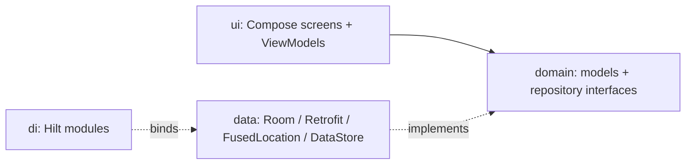
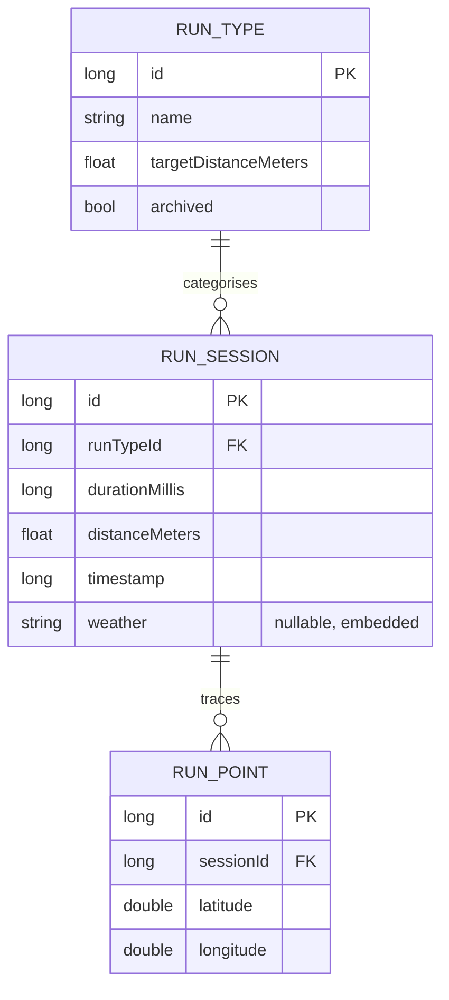

# Run-Tracker

An Android running app built around **Run Types**: named distance goals like "5K Park Loop" or "2.5K Morning". Pick one, start running, and the app stops the run itself the moment you hit the target.

That automatic stop is the point. Because every attempt at a Run Type covers exactly the same distance, the times are directly comparable, so you can see whether you are actually getting faster at *your* 5K rather than comparing a 5K against an unrelated 8K.

Built with Jetpack Compose, Room, Hilt, Retrofit, and the Google Maps and OpenWeather APIs.

## Features

- **Run Types** — create a category with a name and a target distance in metres. Your last choice is remembered between launches.
- **Automatic finish** — the run ends and saves itself when the target distance is reached. You can also pause and stop manually.
- **Live GPS tracking** — your route draws itself on an interactive map as you move, with running distance, duration, and pace. Noisy GPS fixes are filtered out so the line stays smooth.
- **Spoken feedback** — a text-to-speech countdown from 3 at the start, plus vibration and an announcement when the run completes, so you do not need to look at the phone.
- **Weather snapshot** — conditions at your start location are captured with the run. Offline, the run still saves with the weather fields empty.
- **Dashboard metrics** — average pace, best time, weekly distance, and a week-on-week trend, filterable by Run Type.
- **History** — every session as a card with a route thumbnail. Tap for the full summary.

## Requirements

- Android Studio (AGP 9.1, Kotlin 2.2)
- JDK 11
- A device on Android 8.0 (API 26) or higher
- API keys for Google Maps and OpenWeather

> [!TIP]
> Use a physical phone rather than an emulator. Live tracking depends on real GPS movement, and mock locations will not give you realistic distance or pace.

## Installation

```bash
git clone https://github.com/JoseSilva1997/Coursework.git
cd Coursework
```

Create `secrets.properties` in the project root. It is gitignored, so it will not be in your clone:

```properties
MAPS_API_KEY=your_maps_sdk_key
MAPS_STATIC_API_KEY=your_static_maps_key
OPEN_WEATHER_API_KEY=your_openweather_key
```

| Key | Used for | Where to get it |
|-----|----------|-----------------|
| `MAPS_API_KEY` | Live and summary route maps | [Google Cloud Console](https://console.cloud.google.com/), enable **Maps SDK for Android** |
| `MAPS_STATIC_API_KEY` | Route thumbnails in History | Same project, enable **Maps Static API** |
| `OPEN_WEATHER_API_KEY` | Weather at run start | [OpenWeather](https://openweathermap.org/api), the free tier is enough |

> [!NOTE]
> The two Maps keys can be the same key, as long as both APIs are enabled on it.

Then build and install:

```bash
./gradlew installDebug
```

## Usage

**Create a Run Type.** On the Dashboard, tap *Add run type*, then give it a name and a target distance in metres. The distance is validated before it saves.

**Start a run.** Tap the diamond button in the centre of the navigation bar and pick a Run Type from the sheet. Grant location permission when prompted, press START, and wait out the spoken countdown.

**Run.** The map tracks you live. Pause and resume as needed. When you reach the target distance, the run finishes on its own and takes you to the Summary. To end early, pause and then stop.

**Review.** Summary shows distance, duration, pace, route, and weather; tap the route preview to expand it full screen. History lists past sessions, and the Dashboard aggregates them.

## Architecture

Layered MVVM. Composables render, ViewModels hold UI state and coordinate work, and repositories hide the data sources behind interfaces. Hilt wires the implementations in at build time, which is why it does not appear in the runtime flow below.



| Package | Responsibility |
|---------|----------------|
| [ui/](app/src/main/java/com/example/coursework/ui/) | Compose screens, ViewModels, navigation, theme |
| [domain/](app/src/main/java/com/example/coursework/domain/) | Models and repository interfaces |
| [data/](app/src/main/java/com/example/coursework/data/) | Room database, Retrofit weather API, location tracker |
| [di/](app/src/main/java/com/example/coursework/di/) | Hilt modules |
| [util/](app/src/main/java/com/example/coursework/util/) | Mappers, calculations, TTS and vibration helpers |

Dashboard and History are nested inside a parent route so their scroll position and filters survive tab switches. Live Run and Summary sit at the top level of the graph, because each visit should start fresh from its arguments.

<details>
<summary>Database schema</summary>

Room, currently at version 4. Schema JSON is exported to [app/schemas/](app/schemas/), and migrations live in [Migrations.kt](app/src/main/java/com/example/coursework/data/db/migrations/Migrations.kt).



Run points are always loaded through `RunSessionWithPoints` on the session DAO, never on their own, so there is no `RunPointDao`.

Every schema change bumps the version and adds a `Migration`, verified by [MigrationTest.kt](app/src/androidTest/java/com/example/coursework/data/db/MigrationTest.kt).

</details>

<details>
<summary>Design decisions worth knowing</summary>

**Two ways of drawing maps.** Live Run and Summary use the interactive Maps SDK so you can pan and zoom. History cards use the Static Maps API instead: rendering a `GoogleMap` composable per row made the list stutter, while a cached PNG per route is cheap.

**Deleting a Run Type is conditional.** With no runs against it, it is deleted outright. With runs, it is archived instead, hiding it from pickers while the historical sessions survive.

**Weather never blocks a save.** A short run can finish before the request returns, so the finish path waits briefly for an in-flight fetch and then saves regardless. Any failure (offline, timeout, API error) saves the run with null weather.

**DataStore, not Room, for preferences.** The last-selected Run Type is a single key, and a table would be overkill.

</details>

## Development

```bash
./gradlew assembleDebug          # build
./gradlew test                   # unit tests
./gradlew connectedAndroidTest   # instrumented tests, including migrations
```

Instrumented tests need a connected device or a running emulator.

## Limitations

Tracking only runs while the app is in the foreground. Locking the phone or backgrounding the app will interrupt it, since there is no foreground service. Background tracking was out of scope for this project.

## Privacy

GPS routes stay on the device, in a local Room database. Nothing is uploaded, and the only network call the app makes is a weather lookup for your start coordinates.

## Licence

No licence specified.
